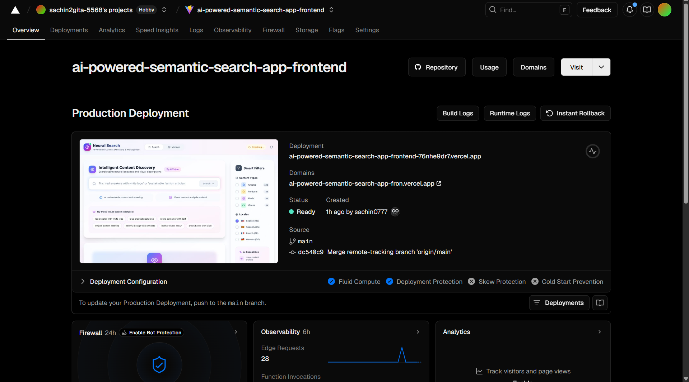
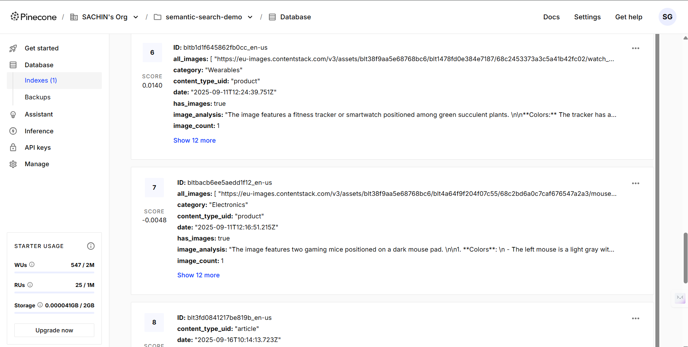

<div align="center">
  
  <h1>🔍 Smart Semantic Search App</h1>
  <p>
    A Contentstack Marketplace App with <b>semantic search</b> powered by OpenAI, Cohere, and Pinecone.<br/>
    Built with React, Vite, Tailwind, Node.js — deployed on Vercel & integrated with Contentstack Launch.
  </p>

  
  
  
  
  
  
  
</div>

---

# 🧩 The Story Behind It  

Traditional keyword search falls short when dealing with massive content repositories.  
I wanted to **search by meaning, not just words** — across both **text and images**.  

That’s why I built **Smart Semantic Search App**.  
It integrates seamlessly with **Contentstack** and leverages **OpenAI, Cohere, and Pinecone** to deliver results that truly understand context.  

---

# ⚡ My Development Journey  

Every good project has struggles — here’s mine:  

- **Version Mismatch & Commands Confusion**  
  When I first tried integrating with Contentstack without checking documentation, I ran into frustrating version mismatches and command changes.  
  Once I referred to the updated docs, things finally cleared up.  

- **Regional Connectivity Issues**  
  The connection between my web app and Contentstack worked fine in some regions but failed in others.  
  After debugging and applying fixes, I made it work consistently across regions.

  # ⚡ Important Please Read Fully

- **Clarity in AI Vision Analysis component displayed in the frontend that you see under the search results**  
  The AI Vision embeddings are generated and stored in **Pinecone DB** (backend), not inside Contentstack entries.  
  You may think i have described the image as a description and added it as a entries in the content type of the product so that when i search 
  by describing then it actually work by key word match but it actully does not work that way !! but it works like when the entry is published in the 
  CMS the Image is passed to Open AI so that the Open AI describe the image in few lines with the understanding of the image and the content in the CMS ans store it in the pincone datatbase,
  then when the user naturally decribe the product in the search engine and if the user description match the Open ai description in the backend then that content is fetched .. between this i have just displayed   the Description of the content as AI VISION ANALYSIS 
  in the frontend but which is not necessary but in order to show how the AI describe it in the backend i have displayed it in the frontend dont misthink that i have used it inside content entry for 
  keyword match function becsue it not added manually but generated by Open ai vision analysis.

---

# 💡 Innovative Extension  

While solving these struggles, I also worked on a feature that goes **beyond my initial problem statement**:  

👉 **Semantic Search in Videos**  
- Extract incidents and context from videos using **NLP + embeddings**.  
- Retrieve the **exact timestamp** of the relevant frame or scene.  
- No need to watch or scrub through the entire video — jump right to the moment you need.  

This bridges semantic understanding not just for text & images, but for **video content too**.  

---

# ✨ Features  

✔️ Semantic search across **text, images, and videos**  
✔️ Multi-model embeddings (**OpenAI + Cohere**)  
✔️ AI Vision Analysis shown in frontend (stored in Pinecone, not Contentstack)  
✔️ Real-time index updates with **Contentstack Webhooks**  
✔️ Reliable cross-region Contentstack connection  
✔️ Video scene semantic search with exact **time-frame retrieval**  
✔️ Scalable with **Pinecone Vector DB**  
✔️ Deployed with **Vercel + Launch**  

---

# 📸 Screenshots  of Website

<p align="center">
  
  
  
  
</p>  

---
# 📸 Screenshots  of Backend and Deployment

<p align="center">
  
  
  
  </p>  

---

# 🚀 Setup & Run Locally  

```bash
### 1️⃣ Clone the Repository
git clone https://github.com/sachin0777/Ai_Powered_Semantic_Search_App.git
cd Ai_Powered_Semantic_Search_App

### 2️⃣ Install Dependencies
npm install

### 3️⃣ Start the Frontend
cd frontend
npm install
npm run dev
# → http://localhost:5173

### 4️⃣ Start the Backend
cd backend
npm install
npm run dev
# → http://localhost:3000

### 5️⃣ Add Environment Variables
# Create a .env file inside the backend folder and add:
CONTENTSTACK_API_KEY=your_contentstack_api_key
CONTENTSTACK_DELIVERY_TOKEN=your_delivery_token
CONTENTSTACK_ENVIRONMENT=your_environment_name
OPENAI_API_KEY=your_openai_api_key
COHERE_API_KEY=your_cohere_api_key
PINECONE_API_KEY=your_pinecone_api_key

### 6️⃣ Deploy
# Frontend → Deploy on Vercel
# Backend  → Deploy as Vercel serverless
# Contentstack Launch → Integrate app UI directly into Contentstack


